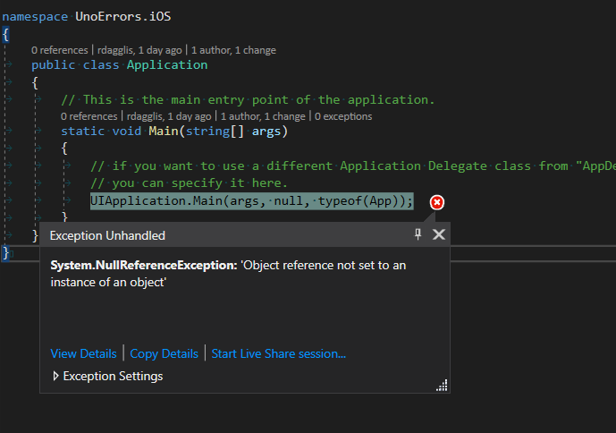

# UnoErrors

This project is to simply show two errors I've come across using the Uno Platform

# 1. Animation crashing on iOS

By simply running the solution on iOS, you'll get the following crash:



Debugging with Uno gives shows the error at the following location:


# 2. Wasm hangs on splash screen when using Activation OR RoutedViewHost of ReactiveUI

## Steps to reproduce both errors

**Error 1**: Go to MainPage.xaml and uncomment the Xaml code at the bottom, then run the applcation.

```
RoutedViewHost: Couldn't find an IPlatformOperations implementation. Please make sure you have installed the latest version of the ReactiveUI packages for your platform. See https://reactiveui.net/docs/getting-started/installation for guidance.
```

**Error 2**: Go to MainPage.cs and uncomment the code in the constructor, then run the applcation.

```
Loaded: Uno.UI.dll
mono.js:1 initializing mono runtime
mono.js:1 >>mono_wasm_runtime_ready
mono.js:1 LogHost: Initializing to normal mode
mono.js:1 LogHost: It seems you are running .NET Standard, but there is no host package installed!
mono.js:1 
mono.js:1 LogHost: You will need to install the specific host package for your platform (ReactiveUI.WPF, ReactiveUI.Blazor, ...)
```
